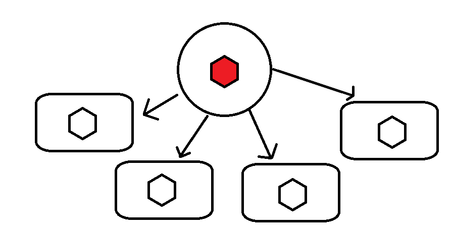

# BNR

**BNR** is a small multiplayer game made using **Unity Engine 6**, paired with **Mirror** for handling player connections.

##  Idea

The core idea is to create a **free-for-all multiplayer PvP** where players farm enemies and collect items to become stronger. The goal is to be the **last player standing**.

## Core Mechanics

The game relies on four main mechanics:

1. **Player Movement**  
2. **Enemy Spawning**  
3. **Item Spawning**  
4. **Weapons & Combat**

## How to play

1. Go to [Dowloads](Downloads) and find your game version (Currently only windows)
2. Dowload the game and run it
3. Run another instance of the game under the same network
4. Join or Host a game
5. You need 2-4 player and then you can start playing

## Controls 

* Move your character with WASD
* Control de camera with mouse movevement
* Jump using space
* Use qe to go up down on spectator mode

## The Challenge

The biggest challenge was getting all mechanics to work together **while staying synchronized across all clients and the server**.

Another major challenge was **experimenting with different methods** for each mechanic — both to learn and to see what worked best.

## How Was It Built?

Each system was developed using a unique approach (mainly for testing/learning). Here's a breakdown:

### Player Movement

Each player is spawned in every game instance. Only the **local player** sends input to the server. The server processes that input and sends back the resulting movement, jump, or attack to all clients.

  

### Enemy Spawning

Enemies are **server-spawned and server-controlled**.

1. The server spawns an enemy and sends its data to all clients:  
   

2. Each client receives a local copy of the enemy, but the **server controls all behavior**:  
   

3. The server calculates the enemy’s next action:  
   

4. Clients replicate the enemy's action to remain synced:  
   

---

### Item Spawning

Initially, items were placed directly into the scene and synced via `NetworkTransform` and `SyncVars`.

  

However, this caused desync issues:
- Items not syncing properly (visually/functionally)
- Ghost or duplicated items across clients

**Solution:** Use the same system as enemy spawning, let the **server spawn and sync all items**.

- Server spawn the item
  
-Each client has its own replica

### Weapons

Weapons use a **custom local system** on each client and communicate changes via **integer IDs**.

1. Each client has a system for loading weapons by ID (handling models, hitboxes, and damage).
2. When a player switches weapons, the ID is sent to the server:
   

3. The server tells all clients which weapon to load for which player:  
   

Clients activate the selected weapon locally (disabling the old one instead of destroying objects).

> This system was the most satisfying to build and is my personal favorite!

## Final Thoughts

Making multiplayer games is way harder than it looks. A tiny change can break everything — what works in one system might completely fail in another.

But it’s **not impossible**. It just takes:
- A *lot* of work (seriously, **a lot**)
- Patience to debug things that randomly explode

